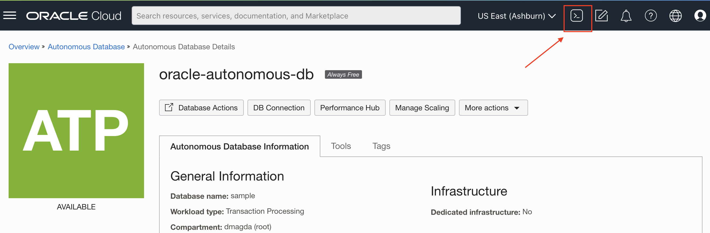

# Stored Procedures and Functions in Java

Is Java your primary programming language? Do you need to create stored procedures for a database? Do you want to develop those procedures in Java?

If YES, then follow the guide below!

<!-- vscode-markdown-toc -->

- [Stored Procedures and Functions in Java](#stored-procedures-and-functions-in-java)
  - [Postgres](#postgres)
    - [Install and Start Postgres](#install-and-start-postgres)
    - [Buld and Install PL/Java](#buld-and-install-pljava)
    - [Run Examples Shipped with PL/Java](#run-examples-shipped-with-pljava)
    - [Install and Run Custom Function](#install-and-run-custom-function)
    - [Update Custom Function](#update-custom-function)
  - [YugabyteDB](#yugabytedb)
  - [Oracle](#oracle)

<!-- vscode-markdown-toc-config
    numbering=false
    autoSave=true
    /vscode-markdown-toc-config -->
<!-- /vscode-markdown-toc -->

## Postgres

For Postgres, you can use the PL/Java extension. Below are few good resources to get to know the module:
* https://tada.github.io/pljava/
* https://flylib.com/books/en/2.290.1/pl_javawriting_stored_procedures_in_java.html

### Install and Start Postgres

You need to build PL/Java from sources. This requires you to get a Postgres instance running on your host machine.

1. Download and install Postgres. For Ubuntu, use the `apt` manager and install the following packages:
    https://tada.github.io/pljava/build/ubuntu.html

2. Start a Postgres instance. Depends on your OS:
    https://tableplus.com/blog/2018/10/how-to-start-stop-restart-postgresql-server.html
  
    For Ubuntu you can use these commands to start and stop the service:
    ```shell
    sudo service postgresql start
    sudo service postgresql stop
    ```
3. Connect to Postgres making sure it's working:
    ```shell
    #For Ubuntu
    sudo -u postgres psql
    ```

### Buld and Install PL/Java

1. Clone:
    ```shell
    git clone https://github.com/tada/pljava.git
    ```
2. Build:
    ```shell
    mvn clean install
    ```
3. Install into Postgres:
    ```shell
    java -jar pljava-packaging/target/pljava-pgX.jar
    ```
4. Create the extension:
    ```sql
    #Connect to the `postgres` database with psql
    sudo -u postgres psql -d postgres
  
    #Specify a libjli location (libjvm for other operating systems)
    SET pljava.libjvm_location TO '/home/dmagda/.sdkman/candidates/java/current/lib/server/libjvm.so';
  
    #Make the setting persistent, so that it applies to all connections to the postgres database
    ALTER DATABASE postgres SET pljava.libjvm_location FROM CURRENT;
    
    #Install the extension
    CREATE EXTENSION pljava;
    ```
5. Make sure you see pljava in the extensions list:
    ```sql
    SELECT * FROM pg_extension;
    ```
### Run Examples Shipped with PL/Java

Test the extension by running examples that are bundled with the pljava:
https://tada.github.io/pljava/examples/examples.html

1. Load the examples into Postgres:
    ```sql
    SELECT sqlj.install_jar(
    'file:'
    '{your_project_root_dir}/pljava/pljava-examples/target/pljava-examples-2-SNAPSHOT.jar',
    'examples', true);
    ```
2. Make sure the `javatest` schema appeared on `search_path`:
    ```sql
    SHOW search_path;
    ```
3. Check that the Java classpath for that schema includes the ID for this jar:
    ```sql
    SELECT sqlj.get_classpath('javatest');
    ```
4. If it doesn't, set the classpath:
    ```sql
    SELECT sqlj.set_classpath('javatest', 'examples');
    ```
5. Run a sample example function:
    ```sql
    SELECT javatest.java_addone(5);
    
         java_addone 
    -------------
               6
    (1 row)
    ```
### Install and Run Custom Function
 
The `CustomFunctionsPostgres` class includes functions that you can add to Postgres and execute via the SQL interface.

1. Build the project:
    ```shell
    mvn clean package
    ```
2. (Optional) curious to see what is in the pljava.ddr file?
    ```sql
    unzip -c target/java-database-functions-1.0.jar pljava.ddr

    #The ouput might be as follows
        Archive:  target/java-database-functions-1.0.jar
    inflating: pljava.ddr              
    SQLActions[]={
    "BEGIN INSTALL
    BEGIN PostgreSQL
    CREATE OR REPLACE FUNCTION postgresSayHi()
            RETURNS pg_catalog.void
            LANGUAGE java VOLATILE
            AS e'void=com.yugabyte.examples.CustomFunctionsPostgres.postgresSayHi()'
    END PostgreSQL;
    BEGIN PostgreSQL
    COMMENT ON FUNCTION postgresSayHi()
    IS e'The Hello World function that returns information about the runtime.'
    END PostgreSQL;
    END INSTALL",
    "BEGIN REMOVE
    BEGIN PostgreSQL
    DROP FUNCTION postgresSayHi()
    END PostgreSQL;
    END REMOVE"
    }
    ```
3. Connect to Postgres:
    ```shell
    #Ubuntu-specific
    sudo -u postgres psql
    ```
4. Install the functions into Postgres:
    ```sql
    SELECT sqlj.install_jar(
    'file:'
    '{your_project_root_dir}/java-database-functions/target/java-database-functions-1.0.jar',
    'java_custom_functions', true);
    ```
    Read this doc to understand what `install_jar` arguments mean: https://github.com/tada/pljava/wiki/SQL-functions
5. Add the jar to the Postgres `public` schema:
    ```sql
    select sqlj.set_classpath('public', 'java_custom_functions');
    ```
6. Make sure the Jar is on the `public` schema's classpath:
    ```sql
    select sqlj.get_classpath('public');

         get_classpath     
    -----------------------
    java_custom_functions
    (1 row)
    ```
7. Run the following function that returns information about your runtime:
    ```sql
    SELECT public.postgresSayHi();
    ```

 ### Update Custom Function
 
 As a developer you change the code all the time. Which means that our Java functions needs to be updated, recompiled and redeployed to Postgres.

 1. Go ahead and change the implementation of the `CustomFunctionsPostgres.postgresSayHi()` function (at a minimum, change the message printed by the function) and redeploy the function to Postgres.

 2. Create a new package:
    ```shell
    mvn clean package
    ```
3. Redeploy the function to Postgres using the [replace_jar](https://github.com/tada/pljava/wiki/SQL-functions#replace_jar) procedure:
    ```sql
    SELECT sqlj.replace_jar(
    'file:'
    '{your_project_root_dir}/java-database-functions/target/java-database-functions-1.0.jar',
    'java_custom_functions', true);
    ```
4. Execute the updated function:
    ```sql
    SELECT public.postgresSayHi();
    ```
## YugabyteDB

TBD

## Oracle

Oracle Database runs Oracle JVM natively. The JVM is [deeply integrated into the database](https://docs.oracle.com/en/database/oracle/oracle-database/19/jjdev/Java-application-database-session.html).

## Enable Oracle JVM with Autonomous Database

The [following guide](https://docs.oracle.com/en/database/oracle/oracle-database/19/jjdev/installation-and-configuration.html#GUID-D4659736-30EB-4810-ADA0-F2D8E1BE4F77) gives a high-level overview of the configuration process. But that guide lacks precise step-by-step instructions. Instead, let's [follow another guide](https://docs.oracle.com/en/cloud/paas/autonomous-database/adbsa/autonomous-oracle-java.html#GUID-2516EE33-B38D-4270-BE52-30A4F9014E8B) that shows how to enable Java for the Oracle Autonomous Database (the cloud version).

1. Start an Oracle Autonomous Database:
    http://cloud.oracle.com/

2. Start Oracle Cloud Shell:
    

3. Follow the guide below to connect to the database from Cloud Shell:
    https://blogs.oracle.com/cloud-infrastructure/post/simple-steps-to-connect-autonomous-database-from-oci-cloud-shell

    Note, add the `TNS_ADMIN` variable to the `.bashrc` file so it's always set if Cloud Shell is restarted.

4. Enable Java on the database end:
    ```sql
    BEGIN DBMS_CLOUD_ADMIN.ENABLE_FEATURE(feature_name => 'JAVAVM');
    END;
    /
    ```
5. [Restart](https://docs.oracle.com/en/cloud/paas/autonomous-database/adbsa/autonomous-restart.html#GUID-333DD791-F14C-437C-8B2F-05EF78742493) the database to finish the Java installation

6. Check the Java version:
    ```sql
    SELECT status, version FROM DBA_REGISTRY WHERE comp_id = 'JAVAVM';
    ```
7. Check the JDK version:
    ```sql
    SELECT dbms_java.get_jdk_version FROM DUAL;
    ```

## Install and Run Custom Functions

1. Compile the `CustomFunctionsOracle.java` class

2. Load the class to the Cloud Shell instance (feel free to use other methods):
    https://docs.oracle.com/en-us/iaas/Content/API/Concepts/devcloudshellgettingstarted.htm#Cloud_Shell_Transferring_Files

3. Connect to the database and load the file:
    ```shell
    sqlplus {username}@{database_name}
    ```
    replace `{username}` and `{database_name}` with your settings.

4. You need to have [several security permissions](https://docs.oracle.com/database/121/JJDEV/chten.htm#JJDEV10000) in place before deploy the Java code:
    ```sql
    grant JAVASYSPRIV to ADMIN;

    call dbms_java.grant_permission('ADMIN', 'SYS:java.io.FilePermission', '<<ALL FILES>>',  'read,write');
    ```

5. Load the file onto the database:
    ```sql
    call dbms_java.loadjava('{class_dir}/CustomFunctionsOracle.class');
    ```
6. Next steps, not finished yet.

## Apache Ignite

Apache Ignite support a comprehensive compute API for Java. You can think of it as of an advanced version of stored procedures.

## Install and Start Ignite

1. Download Ignite 2.13.0 (the binary package):
    https://ignite.apache.org/download.cgi

2. Navigate to the `bin` directory:
    ```shell
    cd apache-ignite-2.13.0-bin/bin
    ```
3. Create a configuration file name `ignite_config.xml` with the following content:
    ```xml
    <beans xmlns="http://www.springframework.org/schema/beans"
       xmlns:xsi="http://www.w3.org/2001/XMLSchema-instance"
       xsi:schemaLocation="
       http://www.springframework.org/schema/beans
       http://www.springframework.org/schema/beans/spring-beans.xsd">
    
        <bean class="org.apache.ignite.configuration.IgniteConfiguration">
            <property name="peerClassLoadingEnabled" value="true"/>
        </bean>
    </beans>
    ```
4. Start an Ignite server node with that configuration:
    ```shell
    ./ignite.sh ignite_config.xml
    ```

## Run Custom Compute Task

1. Compile and start the `CustomFunctionsIgnite.java` class

    Note, if you're on Java 9+ then add the following JVM arguments to the class startup:
    ```shell
    --add-exports=java.base/jdk.internal.misc=ALL-UNNAMED --add-exports=java.base/sun.nio.ch=ALL-UNNAMED --add-exports=java.management/com.sun.jmx.mbeanserver=ALL-UNNAMED --add-exports=jdk.internal.jvmstat/sun.jvmstat.monitor=ALL-UNNAMED --add-exports=java.base/sun.reflect.generics.reflectiveObjects=ALL-UNNAMED --add-opens=jdk.management/com.sun.management.internal=ALL-UNNAMED --add-opens=java.base/java.nio=ALL-UNNAMED --add-opens=java.base/java.util=ALL-UNNAMED --illegal-access=permit
    ```
2. Check the logs of the Ignite server node. The logic will be executed there!

## Update Custom Task

1. Go ahead and update the `CustomFunctionsIgnite.igniteSayHi()` method the way you like.

2. Restart the app. Check the server logs. The new version of the logic will be updated automically.